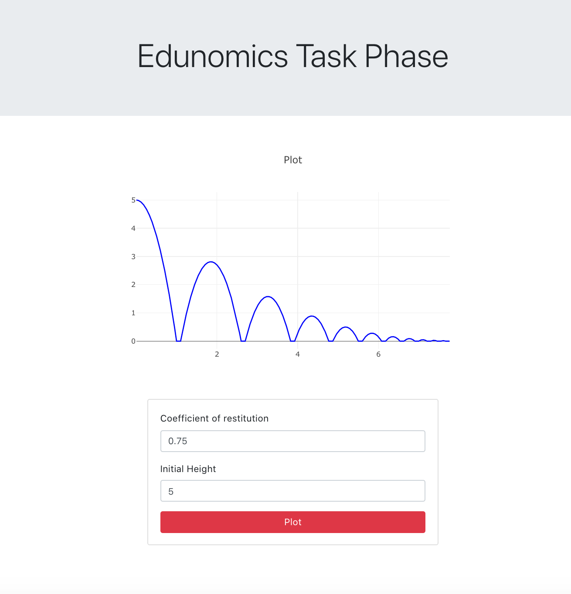

# Edunomics Task Phase

Given **initial height** and **coefficient of restitution**:

- Make a backend that gives **no. of bounces** and **plot points for graph**
- Make a frontend that displays the **graph**

## Backend Api Links

### POST [/calculate](https://taskphase.herokuapp.com/calculate)

body should be of the type:

{
  "coeff": 0.75,
  "height": 5
}

### GET [/history](https://taskphase.herokuapp.com/history)

Will return the records of previous answers

## Frontend

